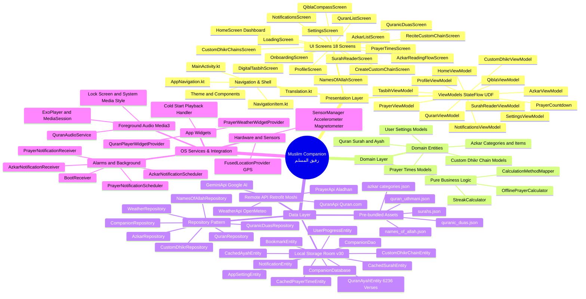
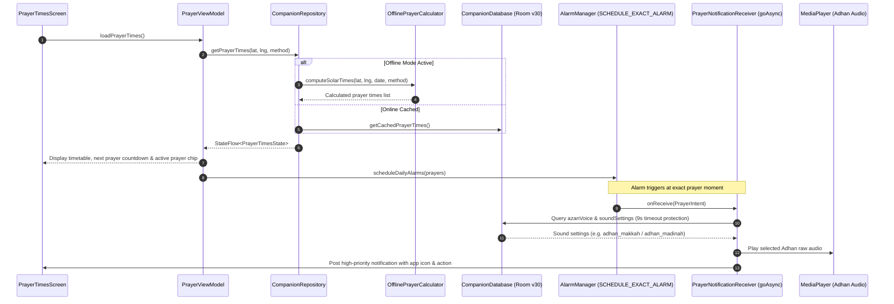
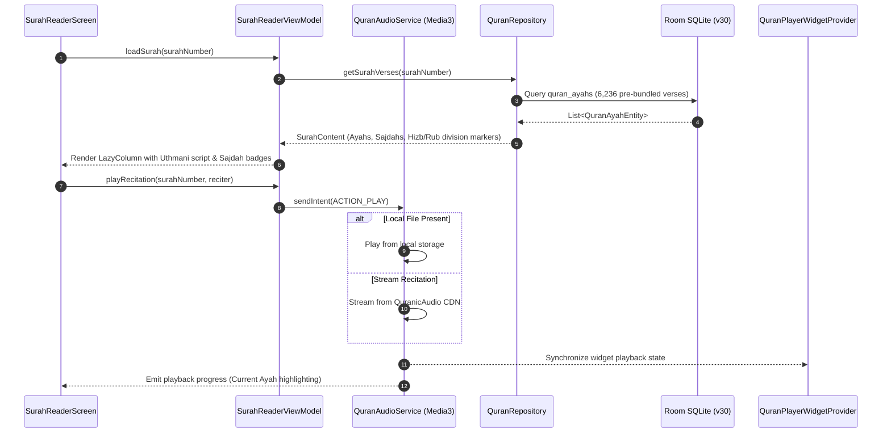
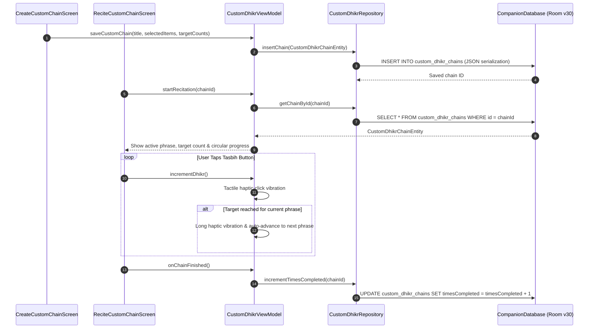

# Muslim Companion (رفيق المسلم) — Architectural Mind Map & System Topology
**Date:** September 24, 2026  
**Application:** Muslim Companion (`com.companion.muslim.app`)  
**Architecture:** Modern Android Development (MAD) Clean Architecture (Presentation, Domain, Data) with Unidirectional Data Flow (UDF) & Dagger-Hilt DI  

---

## 1. High-Level Architectural Mind Map

The following Mermaid mind map visualizes the structural organization and functional breakdown of the codebase:

---

## 2. File Dependency & Module Interaction Graph

This diagram illustrates concrete file dependencies and how classes interact across the Clean Architecture boundaries:

```mermaid
flowchart TB
    subgraph UI_Screens["Presentation: Compose Screens"]
        HomeScr["HomeScreen.kt"]
        ReaderScr["SurahReaderScreen.kt"]
        PrayerScr["PrayerTimesScreen.kt"]
        AzkarFlowScr["AzkarReadingFlowScreen.kt"]
        CustomChainScr["CustomDhikrChainsScreen.kt"]
        TasbihScr["DigitalTasbihScreen.kt"]
        QiblaScr["QiblaCompassScreen.kt"]
        SettingsScr["SettingsScreen.kt"]
    end

    subgraph UI_VM["Presentation: ViewModels & StateFlow"]
        HomeVM["HomeViewModel.kt"]
        ReaderVM["SurahReaderViewModel.kt"]
        PrayerVM["PrayerViewModel.kt"]
        Countdown["PrayerCountdown.kt"]
        AzkarVM["AzkarViewModel.kt"]
        CustomVM["CustomDhikrViewModel.kt"]
        TasbihVM["TasbihViewModel.kt"]
        QiblaVM["QiblaViewModel.kt"]
        SettingsVM["SettingsViewModel.kt"]
    end

    subgraph DI["Dependency Injection (Hilt)"]
        AppModule["AppModule.kt"]
    end

    subgraph Domain["Domain Layer"]
        Streak["StreakCalculator.kt"]
        MethodMap["CalculationMethodMapper.kt"]
        SolarCalc["OfflinePrayerCalculator.kt"]
    end

    subgraph Repos["Data: Repositories"]
        CompRepo["CompanionRepository.kt"]
        QuranRepo["QuranRepository.kt"]
        AzkarRepo["AzkarRepository.kt"]
        CustomRepo["CustomDhikrRepository.kt"]
        WeatherRepo["WeatherRepository.kt"]
    end

    subgraph Local_DB["Data: Room SQLite v30 & Assets"]
        RoomDB["CompanionDatabase.kt"]
        RoomDAO["CompanionDao.kt"]
        Entities["Entities.kt"]
        RawAudio["res/raw Audio (Adhan & Chimes)"]
        JSONAssets["assets/ (Quran, Azkar, Duas)"]
    end

    subgraph Remote_Net["Data: Remote Network"]
        RetrofitClient["Shared OkHttpClient & Moshi"]
        PrayerApi["PrayerApi.kt"]
        QuranApi["QuranApi.kt"]
        WeatherApi["WeatherApi.kt"]
    end

    subgraph OS_Integration["OS Services, Widgets & Receivers"]
        AudioSvc["QuranAudioService.kt (Media3)"]
        PrayerReceiver["PrayerNotificationReceiver.kt"]
        PrayerScheduler["PrayerNotificationScheduler.kt"]
        AzkarReceiver["AzkarNotificationReceiver.kt"]
        PrayerWidget["PrayerWeatherWidgetProvider.kt"]
        QuranWidget["QuranPlayerWidgetProvider.kt"]
    end

    %% UI to ViewModel bindings
    HomeScr --> HomeVM
    ReaderScr --> ReaderVM
    PrayerScr --> PrayerVM
    PrayerScr --> Countdown
    AzkarFlowScr --> AzkarVM
    CustomChainScr --> CustomVM
    TasbihScr --> TasbihVM
    QiblaScr --> QiblaVM
    SettingsScr --> SettingsVM

    %% ViewModels to Repositories & Domain
    HomeVM --> CompRepo
    HomeVM --> WeatherRepo
    PrayerVM --> CompRepo
    PrayerVM --> MethodMap
    PrayerVM --> Streak
    ReaderVM --> QuranRepo
    AzkarVM --> AzkarRepo
    CustomVM --> CustomRepo
    TasbihVM --> CompRepo
    SettingsVM --> CompRepo

    %% DI Injections
    AppModule -.-> CompRepo
    AppModule -.-> QuranRepo
    AppModule -.-> AzkarRepo
    AppModule -.-> CustomRepo
    AppModule -.-> RoomDB
    AppModule -.-> RetrofitClient

    %% Repository Layer Integrations
    CompRepo --> RoomDAO
    CompRepo --> PrayerApi
    CompRepo --> SolarCalc
    QuranRepo --> RoomDAO
    QuranRepo --> QuranApi
    QuranRepo --> JSONAssets
    AzkarRepo --> JSONAssets
    AzkarRepo --> RoomDAO
    CustomRepo --> RoomDAO
    WeatherRepo --> WeatherApi

    RoomDB --> RoomDAO
    RoomDAO --> Entities

    %% Audio & Widget interactions
    ReaderVM -.-> AudioSvc
    QuranWidget ==>|Direct Broadcast| AudioSvc
    AudioSvc --> RoomDAO
    PrayerScheduler --> PrayerReceiver
    PrayerReceiver --> RoomDB
    PrayerReceiver --> RawAudio
    AzkarReceiver --> RoomDB
    PrayerWidget --> RoomDAO
```

---

## 3. Active Runtime Data Flows

### A. Prayer Time Calculation & Exact Adhan Notification

---

### B. Holy Quran Reader & Gapless Audio Playback

---

### C. Custom Dhikr Chains Creation & Guided Recitation Flow

---

## 4. Key Architectural Patterns Employed

1. **Unidirectional Data Flow (UDF):** Every UI screen observes an immutable `StateFlow` from its dedicated `ViewModel`, emitting user interactions as events.
2. **Offline-First Resilience:** 100% of core worship capabilities (full Quran Uthmani scripture, Hadith supplications, solar geometry calculations, and Asma Ul-Husna) function completely offline without internet access.
3. **Decoupled Background Services:** Background Quran recitation is handled via AndroidX `MediaSessionService` with lock-screen MediaStyle notifications; exact prayer alarms use `goAsync()` BroadcastReceivers with timeout safeguards.
4. **Resilient Home Screen Widgets:** Standalone widget providers with cold-start audio restoration and live prayer countdown chips.
