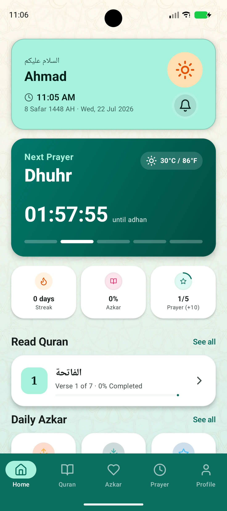
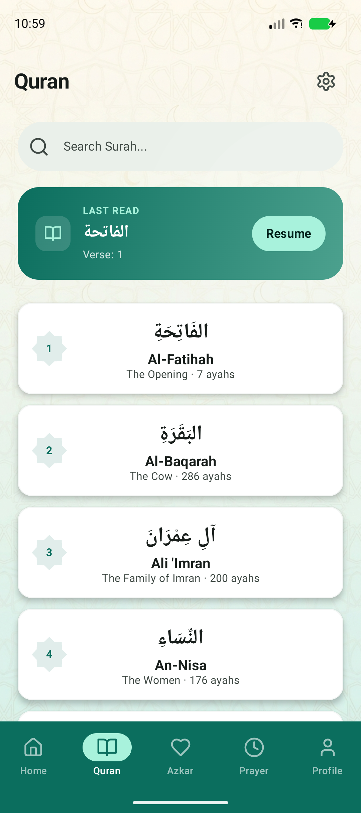
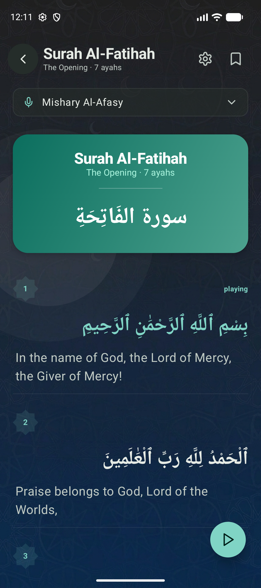
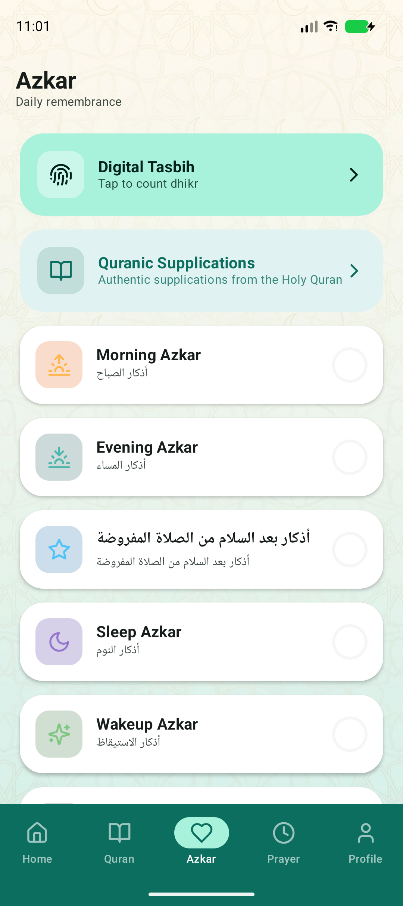
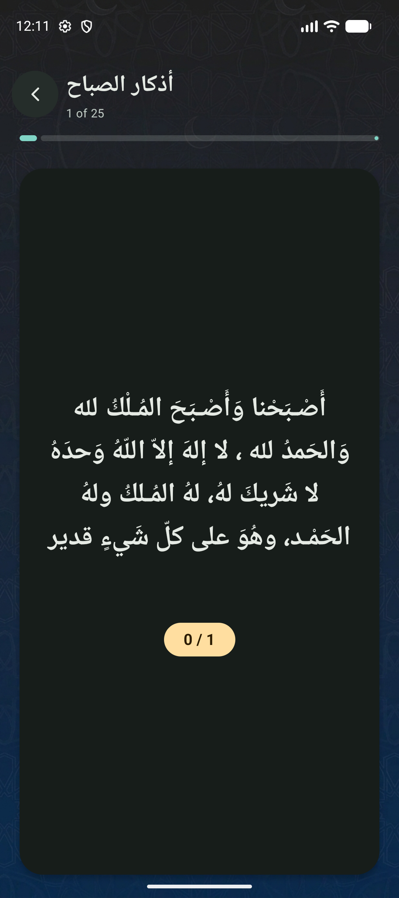
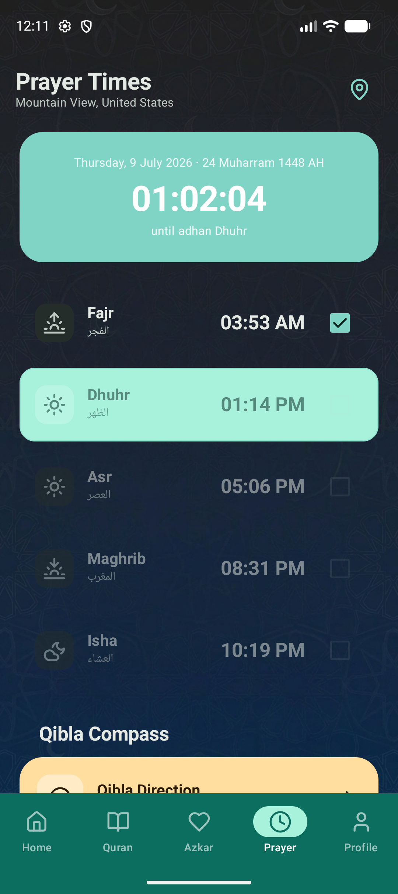
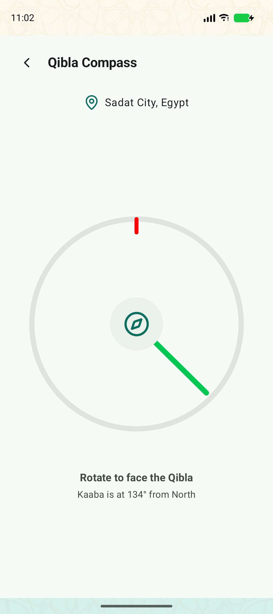
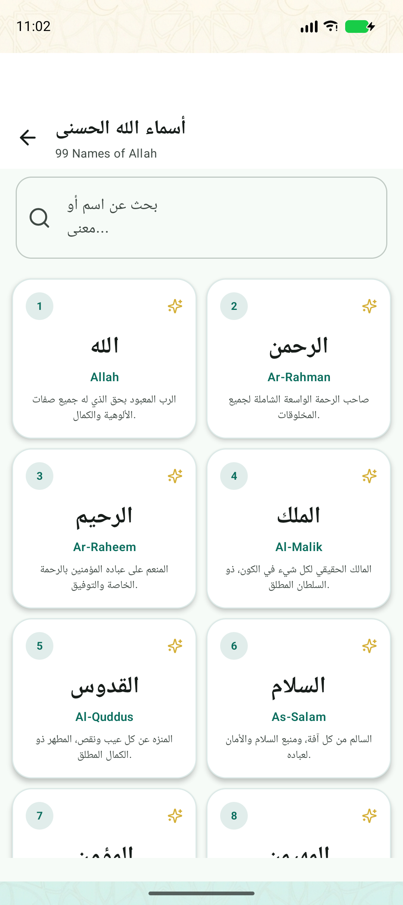
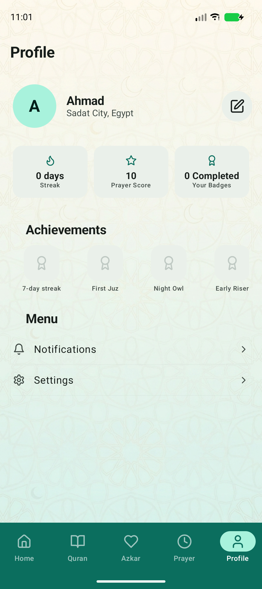
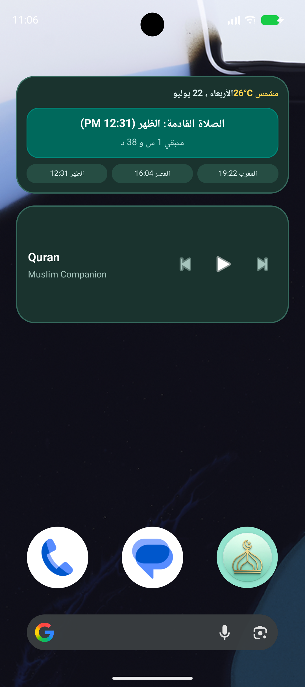

# Muslim Companion (Android Application)

Muslim Companion is a feature-rich, high-performance, and beautifully designed Android companion app built using modern Android development best practices. It helps users manage their daily prayers, read the Holy Quran, count dhikr, and keep track of daily remembrance routines (Azkar).

---

## Key Features

### 📖 Quran Surah Reader
- **Offline-First Storage:** Integrated Room database with asset-based seeding to load the full Uthmani Arabic scripture text offline, caching English translations from Quran.com for seamless offline access.
- **Dual Script Rendering:** Parallel rendering of Arabic text (Uthmani script) and English translations.
- **Customizable Layout:** Centered divider format, aligning Arabic text to the right and English translation to the left for natural reading flow.
- **Verse Indicators:** Every verse features an authentic **Rub El Hizb** icon header showing the verse number.
- **Translation Toggle:** Quickly show/hide translations to focus purely on the Arabic scripture.
- **Offline & Streaming Audio:** Gapless verse-by-verse audio playback using AndroidX **Media3 (ExoPlayer)**, supporting multiple reciters and offline downloaded audio paths.
- **Customization Settings:** Custom preferences to scale Arabic text size, change fonts, and keep screen awake.

### 📿 Digital Tasbih Counter
- **Phrase Selector:** Chip selectors at the top to switch between popular remembrance phrases (e.g., *Subhan Allah*, *Alhamdulillah*, *Allahu Akbar*) loaded dynamically.
- **Target Tracking:** Set custom targets per phrase and track counts with interactive tap-to-increment circle controls.
- **Auto-Advance Flow:** Auto-advances to the next phrase in the list upon completing a phrase cycle (reaching target count).
- **Count Lock and Reset:** The last phrase locks its count upon completion and does not reset to 0 until the user taps Reset or the next prayer time comes.
- **Tactile Feedback:** Built-in vibration haptic feedback on increments.

### 🌟 Daily Azkar & Supplications
- **3x2 Grid Widget:** The Home screen features a responsive 3x2 grid natively displaying daily remembrance categories.
- **Expanded Supplications:** Includes newly added sections for **Dua Al-Istikhara (دعاء الاستخارة)** and **Dua for the Sick (دعاء للمريض)**.
- **Dark Mode Optimization:** Custom tinted icons adapting gracefully with elevated brightness on Dark Mode.
- **Progress Trackers:** Features inline category-themed `LinearProgressIndicator`s to dynamically track dhikr progress.
- **Completion Badges:** Displays solid checkmark icons once categories reach 100% completion.
- **Horizontal Pager Flow:** In the Azkar reading screen, uses a `HorizontalPager` allowing users to swipe forward or backward to navigate through daily remembrance cards.
- **Auto-Advance:** Card automatically scrolls to the next remembrance once the target count is completed.

### 🏆 Achievement Badges
- **Dynamic Unlocking:** Badges such as "First Juz", "7-day streak", "Night Owl", and "Early Riser" unlock dynamically on the Profile screen based on your real-time reading progress and checked prayers.

### 🕋 Prayer Times, Qibla Compass & Notifications
- **Accurate Schedules:** Displays local prayer times (Fajr, Sunrise, Dhuhr, Asr, Sunset, Maghrib, Isha).
- **Azan Notification Scheduler:** Background alarms via `AlarmManager` triggering authentic Adhan playback (`first_adhan.mp3` or `full_adhan.mp3`) at exact prayer times, respecting notification states.
- **Calculation Settings:** Support for major calculation methods (Egyptian General Authority, MWL, ISNA, Karachi).
- **Qibla Alignment:** Real-time Qibla compass pointing directly to the Kaaba using device sensors.
- **Mosque Finder:** Map-linked widget querying nearby mosques using location coordinates and Google Maps (with browser fallback).

### 🎵 Quran Audio Player Widget & Media Session
- **Background Playback Service:** Custom implementation of AndroidX **MediaSessionService** managing a global `ExoPlayer` instance, enabling uninterrupted audio recitation even when the app is closed or the screen is locked.
- **System Media Notification:** Automatically displays a standard **MediaStyle Notification** in the system notification panel with Surah title, reciter name, seeking progress bar, and play/pause/skip controls.
- **Material 3 Home Widget:** Responsive Home screen widget styled with a premium deep-green Material shape. Displays current Surah name, reciter name, and Ayah number, with buttons to control playback (play/pause, next, previous) and tap-to-open shortcuts.

---

## Screenshots

Here is a visual showcase of the main menus and features of the **Muslim Companion** app:

| 🏠 Home Screen | 📖 Quran Surah List | 📖 Quran Reader |
|:---:|:---:|:---:|
|  |  |  |

| 📿 Daily Azkar | 📿 Azkar Flow | 🕋 Prayer Times |
|:---:|:---:|:---:|
|  |  |  |

| 🕋 Qibla Compass | 📿 Digital Tasbih | ⚙️ Profile / Settings |
|:---:|:---:|:---:|
|  |  |  |

| 🎵 Home Screen Player Widget |
|:---:|
|  |

---

## Technical Stack & Architecture

- **UI Framework:** 100% **Jetpack Compose** with Material Design 3 guidelines for a clean, premium, and responsive user experience.
- **Language:** **Kotlin** utilizing Coroutines and Kotlin Flow for reactive, thread-safe asynchronous operations.
- **Architecture:** Clean Architecture pattern splitting the codebase into:
  - **Data Layer:** Room database caches, Retrofit API endpoints, local asset parsers, and repository implementations.
  - **Domain Layer:** Unified data models, repository abstractions, and core business entities.
  - **Presentation Layer:** State-driven Compose screens, Dialogs, and state-holding view models.
- **Dependency Injection:** Powered by **Hilt** (Dagger) for scalable dependency scoping, seamlessly integrated with **WorkManager** via `@HiltWorker` for background synchronization tasks.
- **Local Caching (Room):** Integrates SQLite database caching supporting schema migrations and destructive fallback protection to preserve offline usability.
- **Security & Reliability:** Features comprehensive ProGuard rules, explicit connection timeouts, strict network security configurations, and optimized broadcast receivers to prevent ANRs.
- **Network Client:** **Retrofit + Moshi** integrating directly with the official Quran.com API endpoints.
- **Audio Player:** **AndroidX Media3 (ExoPlayer)** for low-latency network audio streaming.

---

## Installation & Setup

### 📲 Directly Installing the Pre-built APK

You can quickly install and run the app on your physical Android phone without needing to compile code:

1. **Locate the APK:** Go to the [APK](APK/) folder in the root of the project and find `muslim-companion-debug.apk`.
2. **Transfer to Mobile:** Copy this file to your phone's storage via USB, cloud sharing, or messaging app.
3. **Enable Unknown Sources:** On your Android phone, go to **Settings > Security** and enable **"Install unknown apps"** for your file manager or browser.
4. **Install and Launch:** Open your phone's File Manager, tap on `muslim-companion-debug.apk`, click **Install**, and once completed, open the app from your launcher!

---

### 💻 Building from Source (Developers)

1. **Clone the Repository:**
   ```bash
   git clone https://github.com/SHABO-EGYPT/Muslim-Companion.git
   ```
2. **Open in Android Studio:**
   - Open Android Studio, select **Open**, and navigate to the cloned project folder.
   - Allow Gradle to sync and download required dependencies.
3. **Deploy:**
   - Build and run the app directly on an emulator or connected physical Android device.
   - You can compile your own APK by running `Build > Build Bundle(s) / APK(s) > Build APK(s)` in Android Studio.
