# Muslim Companion (رفيق المسلم)

[](https://github.com/SHABO-EGYPT/Muslim-Companion)
[](PRIVACY_POLICY.md)
[-orange.svg)](https://developer.android.com)
[](https://play.google.com/store)

**Muslim Companion (رفيق المسلم)** is a comprehensive, feature-rich, high-performance, and beautifully designed Android Islamic application built using Modern Android Development (MAD) best practices. It helps Muslims worldwide manage daily prayers, read and listen to the Holy Quran, track authentic Azkar & Duas, count dhikr, and determine the Qibla direction.

---

## 🕊️ Noble Dedication & 100% Ad-Free Commitment
> **هذا البرنامج لوجه الله تعالى ومجاني 100% بدون أي إعلانات أو اشتراكات، صُنع كصدقة جارية رحمةً على روح والدتي وعلى جميع أموات المسلمين. نسألكم الدعاء لهم بالرحمة والمغفرة.**
> 
> *Muslim Companion is 100% free and completely ad-free. Dedicated as an ongoing charity (Sadaqah Jariyah) for the sake of Allah in loving memory of the developer's mother and all deceased Muslims. Please remember them in your prayers.*

---

## 🔒 Privacy & Google Play Compliance
- **Zero Ads & Zero Trackers:** Contains no third-party advertisements, analytics trackers, or user data selling.
- **Offline First:** All reading bookmarks, Khatmah progress, and Azkar counters are stored securely on the local device.
- **Official Privacy Policy:** [PRIVACY_POLICY.md](PRIVACY_POLICY.md)
- **Publishing & Release Guide:** [PLAY_STORE_PUBLISHING_GUIDE.md](PLAY_STORE_PUBLISHING_GUIDE.md)

---

## ✨ What's New in v1.7.1

- 📖 **Quran Juz' (الأجزاء), Hizb (الأحزاب), & Rub' (أرباع القرآن) Indicators & Navigation:**
  - **Surahs vs. Juz' Tabs:** Browse all 30 Juz' with starting and ending Surah/Ayah coordinates, opening directly to the start of any Juz.
  - **In-Reader Decorative Banners (`QuranDivisionBanner`):** Elegant Islamic ornaments marking the start of each Juz (`۞ الجزء ۞`), Hizb (`۞ الحزب ۞`), and quarter (`ربع` / `نصف` / `ثلاثة أرباع`).
  - **Dynamic Reader Header:** Real-time subtitle tracking the reader's current Surah, Juz, and Hizb.
- ۩ **Authentic Sujud al-Tilawah (سجدات التلاوة) & Du'a Modal:**
  - Distinctive gold badges (`۩ سجدة تلاوة`) displayed on all 15 Sajdah verses across the Quran.
  - Interactive bottom sheet displaying authentic Prophetic supplications for Sajdah with one-tap clipboard copy.
- 🔤 **Dynamic App-Wide Font Size Scaling:**
  - Real-time typography scaling (**Small / Medium / Large**) applied instantly across all app screens, Azkar cards, and UI components via Compose `Density.fontScale`.
- 📿 **Custom Dhikr Chains ("سلاسل الأذكار المخصصة"):** Build, customize, and save personal sequences of Dhikr (selecting from common phrases or adding custom entries, setting target counts with 1-by-1 steppers, and reciting them in an auto-advancing, full-screen Tasbih flow with haptic feedback).
- ☀️ **100% Offline Astronomical Solar Geometry Calculation Engine:** High-precision astronomical algorithms calculate all 5 daily prayer times without requiring an internet connection across 14 recognized calculation authorities (Egyptian General Authority, Umm Al-Qura University Makkah, Muslim World League, ISNA, Karachi, Kuwait, Qatar, France, Turkey, Singapore, Russia, etc.).
- 📍 **Centralized Location Architecture:** Lifecycle-safe `LocationRepository` uniting multi-tier GPS resolution (`lastLocation` $\to$ `getCurrentLocation(HIGH_ACCURACY)` $\to$ asynchronous `Geocoder` on `Dispatchers.IO`) across all screens.
- 🎙️ **Authentic Recitation CDN Updates:** Recitation audio mapping for Sheikh Mishary Rashid Alafasy, Sheikh Mahmoud Khalil Al-Husary, Sheikh Mohamed Siddiq Al-Minshawi (Mujawwad), and Sheikh AbdulBaset AbdulSamad.
- 🖋️ **Arabic Typography & RTL Enhancements:** Bound `ArabicSerifFamily` to bundled Noto Naskh Arabic font with strict RTL text alignment across Android 14+.
- 🗄️ **Room Database Migration v29:** Seamless, safe migration adding `custom_dhikr_chains` table with zero user data loss.

---

## Key Features

### 📖 Quran Surah Reader & Recitation
- **Offline-First Structure & Divisions:** Comprehensive offline data model for all 30 Juz', 60 Hizbs, 240 Quarters, and 15 Sujud al-Tilawah positions.
- **Juz' & Surah Navigation:** Switch between Surahs and Juz' tabs with real-time search and instant jumping.
- **Sajdah al-Tilawah Annotations:** Interactive Sajdah pill badges with authentic prophetic supplications.
- **Offline-First Scripture Storage:** Integrated Room SQLite database pre-bundled with 6,236 Ayahs of authentic Uthmani Arabic scripture.
- **Dual Script & Translations:** Parallel rendering of Arabic text and English translations from Quran.com.
- **Offline & Gapless Audio Recitation:** Integrated with AndroidX **Media3 (ExoPlayer)** and `MediaSessionService` supporting major reciters:
  - Sheikh Mishary Rashid Alafasy (مشاري العفاسي)
  - Sheikh Abdul Basit Abdul Samad (عبد الباسط عبد الصمد)
  - Sheikh Mahmoud Khalil Al-Husary (محمود خليل الحصري)
  - Sheikh Muhammad Siddiq Al-Minshawi (محمد صديق المنشاوي)
- **Full Offline Audio Downloader:** Download entire Surahs for seamless playback with screen locked or app backgrounded.
- **Reading Progress & Khatmah:** Bookmarks, reading history tracking, and Khatmah completion counter.

### ⏰ Accurate Prayer Times, Adhan & Qibla
- **Precise Location-Based Times:** Calculates Fajr, Sunrise, Dhuhr, Asr, Sunset, Maghrib, and Isha.
- **Major Calculation Methods:** Egyptian General Authority, Umm Al-Qura, Muslim World League, ISNA, University of Karachi, Kuwait, Qatar, France, Turkey, Singapore, Russia, and more.
- **100% Offline Fallback:** Pure Kotlin solar declination equations compute exact prayer schedules offline anywhere in the world.
- **Adhan Notifications:** Accurate background prayer reminders via `SCHEDULE_EXACT_ALARM` with configurable sounds (Full Adhan, First Adhan, Subtle tone, or Silent).
- **Qibla Compass:** Real-time, sensor-driven Qibla compass pointing directly to the Kaaba in Makkah with pre-allocated sensor buffers to eliminate battery drain.
- **Nearby Mosque Finder:** One-tap navigation to nearby mosques via Google Maps.

### 🤲 Fortress of the Muslim (Hisn Al-Muslim) & Azkar
- **Daily Remembrance:** Complete morning, evening, post-prayer (أذكار بعد الصلاة), wakeup, and sleep supplications.
- **Dynamic Category Progress:** Real-time increment tracking per dhikr persisted in Room database.
- **Horizontal Pager Flow:** Interactive swipe cards with auto-advance and haptic feedback upon completion.
- **AI-Powered Azkar Assistant:** Search authentic prophetic supplications for travel, distress, forgiveness, and daily situations.

### 📿 Digital Tasbih & Custom Dhikr Chains
- **Customizable Phrases:** Select between *SubhanAllah*, *Alhamdulillah*, *Allahu Akbar*, *Astaghfirullah*, and custom phrases.
- **Custom Dhikr Chains ("سلاسل الأذكار"):** Create custom routines with target counts, reordering, and step progression.
- **Target Tracking & Auto-Advance:** Set custom targets with tactile vibration feedback on each increment.

### ✨ 99 Names of Allah (أسماء الله الحسنى) & Quranic Duas
- **Asma Ul-Husna:** Interactive catalog with Arabic calligraphy, transliterations, and spiritual meanings.
- **Quranic Duas:** Curated selection of authentic supplications directly from the Holy Quran.

### 📱 Modern Home Screen Widgets
- **Next Prayer & Weather Widget:** Live prayer countdown and current weather status right on the Android home screen.
- **Quran Audio Player Widget:** Quick playback controls (play/pause/skip) with cold-start audio restoration.

---

## Screenshots

| 🏠 Home Screen | 📖 Quran Surah List | 📖 Quran Reader |
|:---:|:---:|:---:|
| 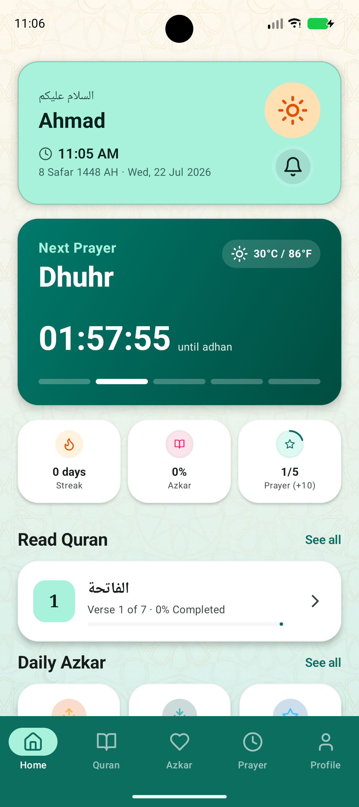 | 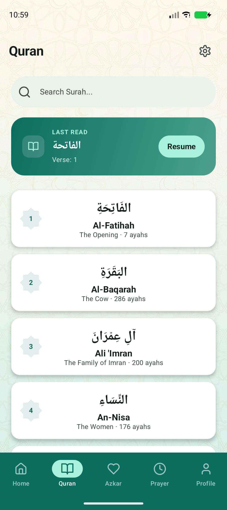 | 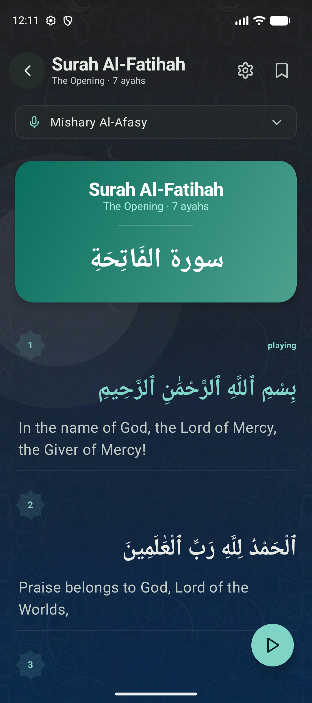 |

| 📿 Daily Azkar | 📿 Azkar Flow | 🕋 Prayer Times |
|:---:|:---:|:---:|
| 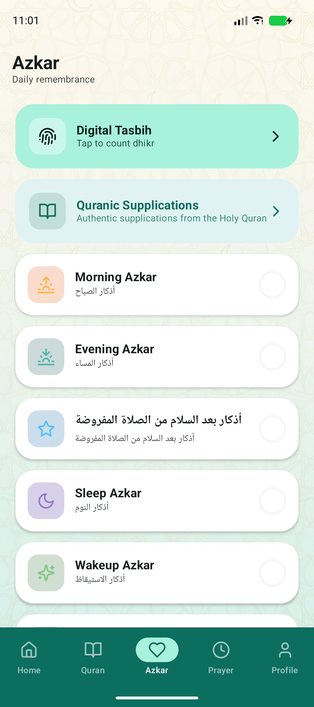 | 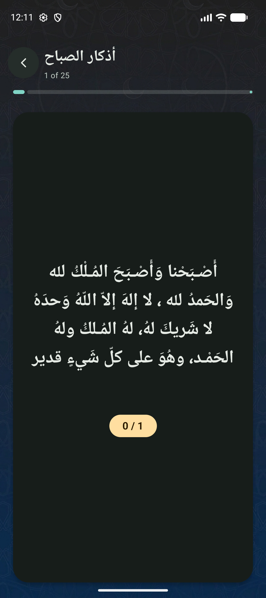 | 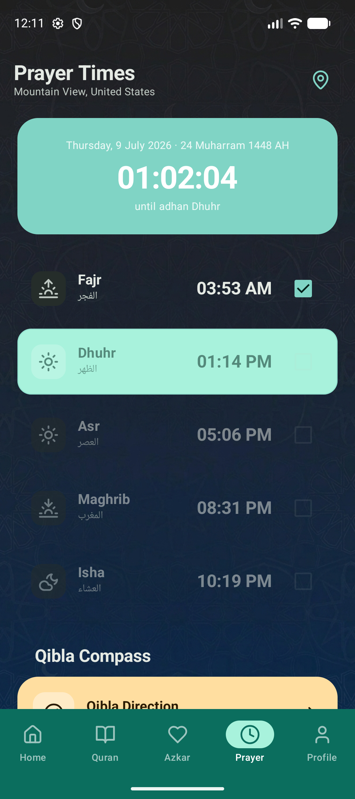 |

| 🕋 Qibla Compass | 📿 Digital Tasbih | ⚙️ Profile / Settings |
|:---:|:---:|:---:|
| 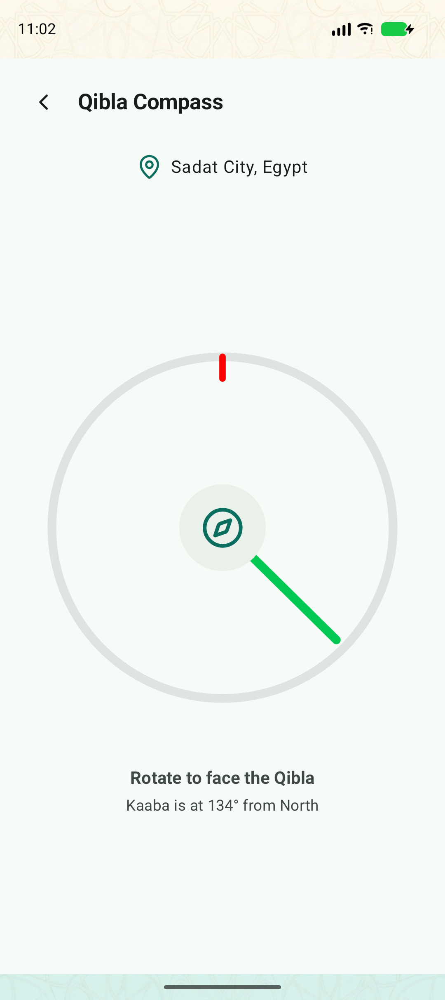 | 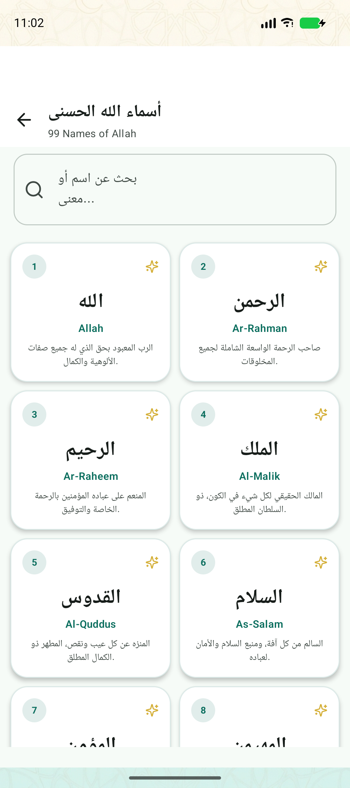 | 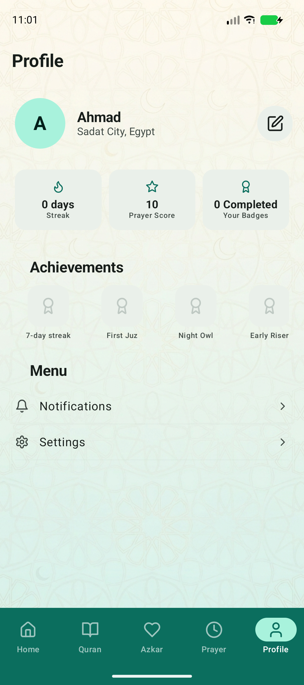 |

| ✨ 99 Names of Allah | 📖 Quranic Supplications | 🎵 Home Screen Player Widget |
|:---:|:---:|:---:|
| 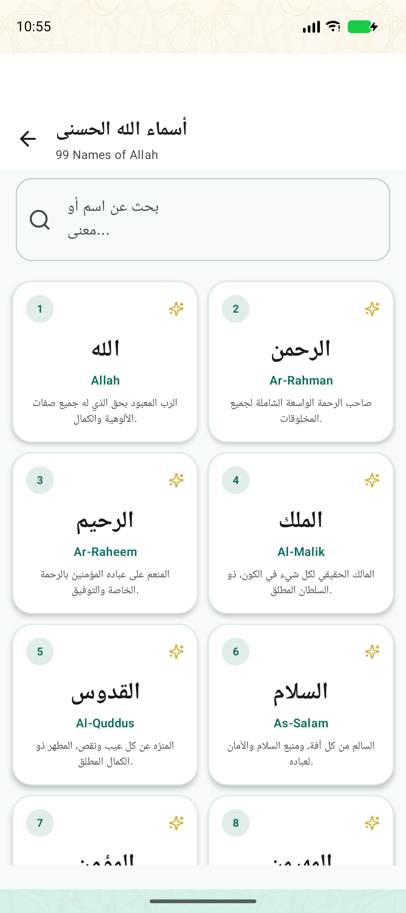 | 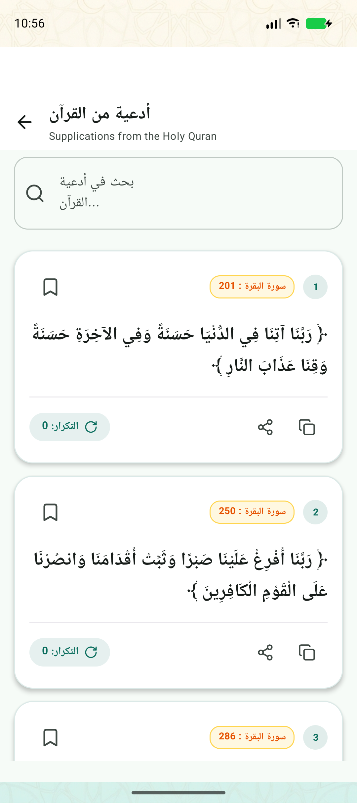 | 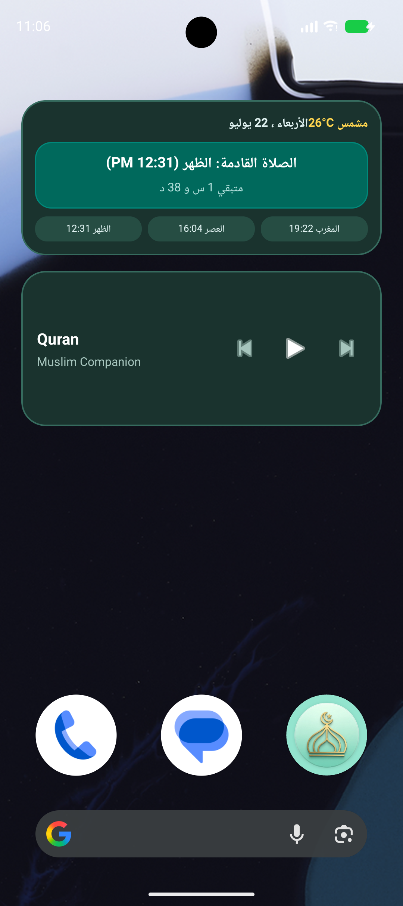 |

| 🔔 Notification Center | ⚙️ Notification Settings |
|:---:|:---:|
| 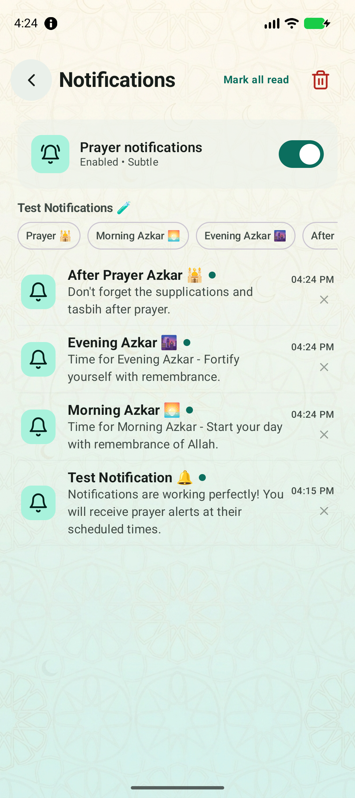 | 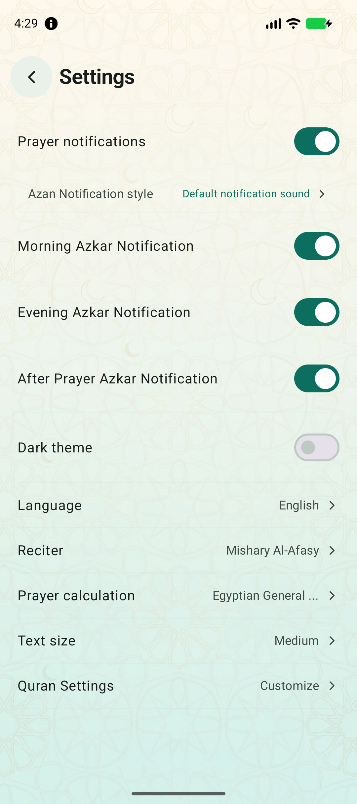 |

---

## Technical Stack & Architecture

- **UI Framework:** 100% **Jetpack Compose** with Material Design 3 guidelines.
- **Language:** **Kotlin** utilizing Coroutines and Kotlin Flow for thread-safe asynchronous operations.
- **Architecture:** Clean Architecture pattern:
  - **Data Layer:** Room SQLite database (v29), Retrofit API endpoints, centralized `LocationRepository`, pure Kotlin `OfflinePrayerCalculator`, and repository implementations.
  - **Domain Layer:** Business models, use cases, and repository abstractions.
  - **Presentation Layer:** Unidirectional Data Flow (UDF) with Compose and ViewModels.
- **Dependency Injection:** **Hilt** (Dagger) with `@HiltWorker` for WorkManager background syncing.
- **Audio Engine:** **AndroidX Media3 (ExoPlayer)** + `MediaSessionService`.
- **Target SDK:** Android 15 (`targetSdk = 37`), `compileSdk = 37`, `minSdk = 26`.
- **Release Optimization:** R8 minification and resource shrinking with hardened ProGuard rules.

---

## Installation & Building

### 📲 Directly Installing the Pre-built APK
1. Download the pre-built APK from the [APK](APK/) folder or GitHub Releases: `Muslim-Companion-1.7.1.apk`.
2. Transfer to your Android device and install.

---

### 💻 Building from Source (Developers)

1. **Clone the Repository:**
   ```bash
   git clone https://github.com/SHABO-EGYPT/Muslim-Companion.git
   cd Muslim-Companion
   ```
2. **Build Debug APK:**
   ```bash
   .\gradlew.bat assembleDebug
   ```
3. **Build Google Play Release Bundle (.aab):**
   ```bash
   .\gradlew.bat bundleRelease
   ```
   The generated production bundle will be located at:
   `app/build/outputs/bundle/release/app-release.aab`
