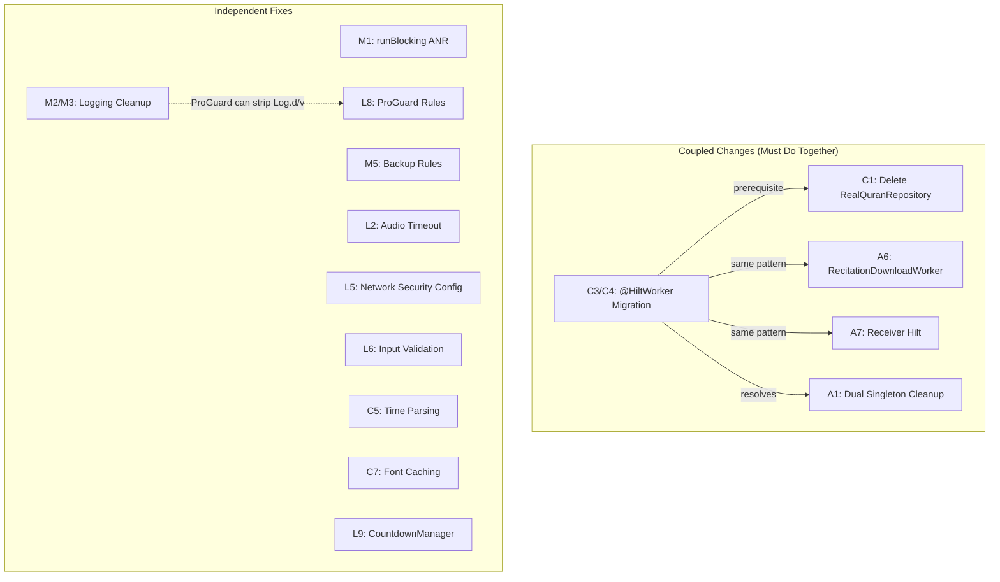

# Review of Security &amp; Improvement Plan — Muslim Companion V1

## Goal
Review and validate the claims, priorities, and proposed fixes in [Newimprovment.md](file:///D:/AI/Projects%20With%20AI/Islamic%20App/Muslim%20Companion%20V1/muslim-companion/Newimprovment.md) against the actual codebase. Assess accuracy, completeness, risk ratings, and implementation feasibility — then provide a fully detailed execution plan with exact code diffs.

---

## Executive Summary

The review document is **well-written, largely accurate, and thorough**. After cross-referencing every claim against the source code, **19 of 20 issues are confirmed** as described. One issue (C1 — "dead code") is **factually incorrect** and would break background sync if executed blindly.

I have identified **8 additional issues** not covered by the plan, **3 proposed fixes that need refinement**, and **critical missing prerequisites** for the `@HiltWorker` migration (C3/C4) that make it significantly more involved than the plan suggests.

---

## Verification Results

| ID | Issue | Verified? | Notes |
|----|-------|-----------|-------|
| M1 | `runBlocking` ANR in BroadcastReceiver | ✅ YES | [PrayerNotificationReceiver.kt:29-31](file:///D:/AI/Projects%20With%20AI/Islamic%20App/Muslim%20Companion%20V1/muslim-companion/app/src/main/java/com/example/notifications/PrayerNotificationReceiver.kt#L29-L31) — `runBlocking` confirmed on main thread |
| M2 | `e.printStackTrace()` in production | ✅ YES | **9 occurrences** across 6 files: [AzkarRepository.kt:46,60](file:///D:/AI/Projects%20With%20AI/Islamic%20App/Muslim%20Companion%20V1/muslim-companion/app/src/main/java/com/example/data/repository/AzkarRepository.kt#L46), [QuranRepository.kt:209,255](file:///D:/AI/Projects%20With%20AI/Islamic%20App/Muslim%20Companion%20V1/muslim-companion/app/src/main/java/com/example/data/repository/QuranRepository.kt#L209), [PrayerSyncWorker.kt:31](file:///D:/AI/Projects%20With%20AI/Islamic%20App/Muslim%20Companion%20V1/muslim-companion/app/src/main/java/com/example/data/worker/PrayerSyncWorker.kt#L31), [QuranSyncWorker.kt:47,63](file:///D:/AI/Projects%20With%20AI/Islamic%20App/Muslim%20Companion%20V1/muslim-companion/app/src/main/java/com/example/data/worker/QuranSyncWorker.kt#L47), [AzkarViewModel.kt:151](file:///D:/AI/Projects%20With%20AI/Islamic%20App/Muslim%20Companion%20V1/muslim-companion/app/src/main/java/com/example/viewmodel/AzkarViewModel.kt#L151), [SurahReaderViewModel.kt:106](file:///D:/AI/Projects%20With%20AI/Islamic%20App/Muslim%20Companion%20V1/muslim-companion/app/src/main/java/com/example/viewmodel/SurahReaderViewModel.kt#L106) |
| M3 | Excessive logging | ✅ YES | **20 `Log.*` calls** across 7 files — no `BuildConfig.DEBUG` guards |
| M4 | No dependency locking | ✅ YES | No `dependencyLocking` in [settings.gradle.kts](file:///D:/AI/Projects%20With%20AI/Islamic%20App/Muslim%20Companion%20V1/muslim-companion/settings.gradle.kts), no lockfiles |
| M5 | Empty backup rules | ✅ YES | Both [backup_rules.xml](file:///D:/AI/Projects%20With%20AI/Islamic%20App/Muslim%20Companion%20V1/muslim-companion/app/src/main/res/xml/backup_rules.xml) and [data_extraction_rules.xml](file:///D:/AI/Projects%20With%20AI/Islamic%20App/Muslim%20Companion%20V1/muslim-companion/app/src/main/res/xml/data_extraction_rules.xml) are commented-out templates |
| M6 | API key as query parameter | ✅ YES | Gemini API constraint — correctly noted as non-fixable |
| L1 | No certificate pinning | ✅ YES | No `CertificatePinner` in any OkHttp client |
| L2 | Audio download no timeout | ✅ YES | **2 locations**: [QuranAudioManager.kt:81](file:///D:/AI/Projects%20With%20AI/Islamic%20App/Muslim%20Companion%20V1/muslim-companion/app/src/main/java/com/example/data/quran/QuranAudioManager.kt#L81) and [QuranSyncWorker.kt:57](file:///D:/AI/Projects%20With%20AI/Islamic%20App/Muslim%20Companion%20V1/muslim-companion/app/src/main/java/com/example/data/worker/QuranSyncWorker.kt#L57) |
| L3 | Weak PendingIntent request codes | ✅ YES | [PrayerNotificationScheduler.kt:25](file:///D:/AI/Projects%20With%20AI/Islamic%20App/Muslim%20Companion%20V1/muslim-companion/app/src/main/java/com/example/notifications/PrayerNotificationScheduler.kt#L25) |
| L4 | No tapjacking protection | ✅ YES | Not found anywhere — but **not relevant** for this app |
| L5 | No network security config | ✅ YES | `network_security_config.xml` does not exist in `res/xml/` |
| L6 | Input not sanitized | ✅ YES | [ProfileViewModel.kt:58-63](file:///D:/AI/Projects%20With%20AI/Islamic%20App/Muslim%20Companion%20V1/muslim-companion/app/src/main/java/com/example/viewmodel/ProfileViewModel.kt#L58-L63) — direct storage |
| L7 | Firebase deps without config | ✅ YES | Declared in catalog but **not wired** in `build.gradle.kts`. `gradle.properties:28` has `googleServices.missing.passthrough=true` |
| L8 | Empty ProGuard rules | ✅ YES | [proguard-rules.pro](file:///D:/AI/Projects%20With%20AI/Islamic%20App/Muslim%20Companion%20V1/muslim-companion/app/proguard-rules.pro) — default template only |
| L9 | CountdownManager scope never cancelled | ✅ YES | [PrayerCountdown.kt:21,27](file:///D:/AI/Projects%20With%20AI/Islamic%20App/Muslim%20Companion%20V1/muslim-companion/app/src/main/java/com/example/viewmodel/PrayerCountdown.kt#L21) — `SharingStarted.Eagerly` |
| L10 | Notification ID collisions | ✅ YES | [PrayerNotificationReceiver.kt:95](file:///D:/AI/Projects%20With%20AI/Islamic%20App/Muslim%20Companion%20V1/muslim-companion/app/src/main/java/com/example/notifications/PrayerNotificationReceiver.kt#L95) |
| C1 | "Dead" `RealQuranRepository` | ⚠️ **INCORRECT** | **NOT dead code** — actively used by [PrayerSyncWorker.kt:22](file:///D:/AI/Projects%20With%20AI/Islamic%20App/Muslim%20Companion%20V1/muslim-companion/app/src/main/java/com/example/data/worker/PrayerSyncWorker.kt#L22) and [QuranSyncWorker.kt:24](file:///D:/AI/Projects%20With%20AI/Islamic%20App/Muslim%20Companion%20V1/muslim-companion/app/src/main/java/com/example/data/worker/QuranSyncWorker.kt#L24) |
| C3/C4 | Workers not using Hilt | ✅ YES | **3 Workers** bypass Hilt (not 2): `PrayerSyncWorker`, `QuranSyncWorker`, and `RecitationDownloadWorker` |
| C5 | Fragile time parsing | ✅ YES | `split(" ")[0]` then `split(":")` in [PrayerCountdown.kt:60-61,93-94](file:///D:/AI/Projects%20With%20AI/Islamic%20App/Muslim%20Companion%20V1/muslim-companion/app/src/main/java/com/example/viewmodel/PrayerCountdown.kt#L60-L61) |
| C6 | Destructive migration fallback | ✅ YES | [CompanionDatabase.kt:84](file:///D:/AI/Projects%20With%20AI/Islamic%20App/Muslim%20Companion%20V1/muslim-companion/app/src/main/java/com/example/data/local/CompanionDatabase.kt#L84) |
| C7 | Font lookup in recompose | ✅ YES | [getQuranFontFamily()](file:///D:/AI/Projects%20With%20AI/Islamic%20App/Muslim%20Companion%20V1/muslim-companion/app/src/main/java/com/example/ui/components/CommonComponents.kt#L138-L146) creates new `FontFamily(Font(...))` per call — used in 6 places, 2 in hot recomposition paths |

---

## User Review Required

> [!IMPORTANT]
> **5 decisions need your input.** I've provided a recommended default for each — if you agree, just approve the plan.

### 1. Backup Strategy (M5) — Recommended: Option 2 (Selective Rules)
- **Option 1:** `allowBackup="false"` — simple but users lose ALL data on phone switch
- **Option 2 (recommended):** Selective rules — exclude DB from cloud, include for device-to-device transfer

### 2. Firebase Dependencies (L7) — Recommended: Remove
Firebase BOM/AI/AppCheck are declared in the version catalog but **not wired** into `build.gradle.kts`. `gradle.properties` confirms `googleServices.missing.passthrough=true`. Unless you plan to add Firebase soon, the catalog entries should be cleaned up.

### 3. Destructive Migration (C6) — Recommended: Keep with Warning Log
Removing `fallbackToDestructiveMigration()` entirely risks crash loops on users with very old DB versions (< 18). Keeping it but adding a `Log.w()` before destruction is the safest balance. You already have migrations for 18→24.

### 4. Worker Repository Strategy (C1 + C3/C4) — Recommended: Migrate Workers to `@HiltWorker`

> [!CAUTION]
> **The plan claims `RealQuranRepository` is dead code. This is WRONG.**

Both [PrayerSyncWorker.kt:22](file:///D:/AI/Projects%20With%20AI/Islamic%20App/Muslim%20Companion%20V1/muslim-companion/app/src/main/java/com/example/data/worker/PrayerSyncWorker.kt#L22) and [QuranSyncWorker.kt:24](file:///D:/AI/Projects%20With%20AI/Islamic%20App/Muslim%20Companion%20V1/muslim-companion/app/src/main/java/com/example/data/worker/QuranSyncWorker.kt#L24) **actively construct `RealQuranRepository(dao)`**. Deleting it would break background sync.

**Fix order:** Migrate Workers to `@HiltWorker` → swap to `OfflineQuranRepository` via DI → *then* delete `RealQuranRepository`.

### 5. Certificate Pinning (L1) — Recommended: Skip
High maintenance overhead (certificate rotations) for a local-use app with no financial data. The plan correctly rates this Low severity.

---

## Concerns & Corrections to the Original Plan

### ❗ Fix Quality Issue: M1 — Needs Timeout

The proposed `goAsync()` fix uses an unstructured `CoroutineScope` without a timeout. BroadcastReceiver has a ~10s ANR window even with `goAsync()`.

**Corrected fix:**
```kotlin
override fun onReceive(context: Context, intent: Intent) {
    val pendingResult = goAsync()
    CoroutineScope(Dispatchers.IO).launch {
        try {
            withTimeout(9_000) { // goAsync() ANR limit is ~10s
                val db = CompanionDatabase.getDatabase(context)
                val settings = db.companionDao().getSettingsDirect() ?: AppSettingEntity()
                if (settings.prayerNotifications) {
                    showNotification(context, intent, settings)
                }
            }
        } finally {
            pendingResult.finish()
        }
    }
}
```

---

### ❗ Fix Quality Issue: L8 — ProGuard Rules Too Broad

The plan suggests `-keep class com.example.** { *; }` which **disables all obfuscation**. This defeats the purpose of ProGuard/R8.

**Corrected rules:**
```proguard
# Room entities (needed for reflection on @ColumnInfo)
-keep class com.example.data.local.*Entity { *; }

# Moshi JSON model classes (codegen handles adapters, but keep models)
-keep class com.example.data.remote.** { *; }

# Keep annotation metadata
-keepattributes *Annotation*

# Strip debug/verbose logs in release
-assumenosideeffects class android.util.Log {
    public static int d(...);
    public static int v(...);
}
```

> [!TIP]
> The `-assumenosideeffects` rule for `Log.d/v` makes M3 partially auto-handled by R8 in release. But you should still add Timber or `BuildConfig.DEBUG` guards for `Log.e/w/i` which are NOT stripped.

---

### ❗ Fix Quality Issue: L3/L10 — hashCode Collision is Overblown

The 5 prayer names (Fajr, Dhuhr, Asr, Maghrib, Isha) produce **unique** hashCodes — collision is not a real risk. The enum approach is still cleaner, but this should not be rated as a security concern.

---

### ℹ️ L4 Tapjacking — Skip

This app has no financial transactions or security-sensitive operations. The onboarding only collects a name and location. `FLAG_WINDOW_IS_OBSCURED` can cause usability issues with accessibility overlays. **Recommend skipping.**

---

### ℹ️ L9 — `WhileSubscribed(5_000)`, Not `WhileSubscribed()`

Since `PrayerCountdownManager` is `@Singleton`, using bare `WhileSubscribed()` would restart the ticker every time the UI recomposes. Use `WhileSubscribed(5_000)` (consistent with all other ViewModels in the project) to give a 5-second grace period during configuration changes.

---

### ❗ C3/C4 — Significantly More Complex Than Stated

The plan says "use `@HiltWorker`" but doesn't mention the **3 prerequisites** that don't exist in the project:

1. **Missing dependency:** `androidx.hilt:hilt-work` is NOT in [libs.versions.toml](file:///D:/AI/Projects%20With%20AI/Islamic%20App/Muslim%20Companion%20V1/muslim-companion/gradle/libs.versions.toml) or [build.gradle.kts](file:///D:/AI/Projects%20With%20AI/Islamic%20App/Muslim%20Companion%20V1/muslim-companion/app/build.gradle.kts)
2. **No `Configuration.Provider`:** [MuslimCompanionApp.kt](file:///D:/AI/Projects%20With%20AI/Islamic%20App/Muslim%20Companion%20V1/muslim-companion/app/src/main/java/com/example/MuslimCompanionApp.kt) does not implement `Configuration.Provider` — required for `@HiltWorker` to inject dependencies
3. **3 Workers** need migration (not 2): `PrayerSyncWorker`, `QuranSyncWorker`, **and** `RecitationDownloadWorker`

---

## Additional Issues Not Covered by the Plan

> [!TIP]
> 8 issues discovered during verification that the review document missed.

### A1. `CompanionDatabase` Has Dual Singleton Pattern
The database has **both** a manual singleton (`@Volatile` + `synchronized` in `getDatabase()`) **and** a Hilt `@Singleton` provider in `AppModule.kt`. Workers bypass Hilt and call the manual path. The manual singleton's `INSTANCE` check means they'll likely share one instance in practice, but the pattern is architecturally unsound.

### A2. Second `URL.openStream()` Without Timeout
[QuranSyncWorker.kt:57](file:///D:/AI/Projects%20With%20AI/Islamic%20App/Muslim%20Companion%20V1/muslim-companion/app/src/main/java/com/example/data/worker/QuranSyncWorker.kt#L57) has the same `URL(urlString).openStream()` without timeout — the plan only mentions `QuranAudioManager`. Both must be fixed.

### A3. Camera Dependencies Declared but Unused
[libs.versions.toml:28-31](file:///D:/AI/Projects%20With%20AI/Islamic%20App/Muslim%20Companion%20V1/muslim-companion/gradle/libs.versions.toml#L28-L31) declares Camera2, Camera Lifecycle, Camera View, and Camera Core, but none are in `build.gradle.kts` dependencies. Dead catalog entries.

### A4. `exportSchema = false` in Room Database
[CompanionDatabase.kt:20](file:///D:/AI/Projects%20With%20AI/Islamic%20App/Muslim%20Companion%20V1/muslim-companion/app/src/main/java/com/example/data/local/CompanionDatabase.kt#L20) disables schema export. For a DB at version 24 with 6 migrations, schema export should be enabled for migration testing.

### A5. `isShrinkResources` Not Enabled
[build.gradle.kts:25](file:///D:/AI/Projects%20With%20AI/Islamic%20App/Muslim%20Companion%20V1/muslim-companion/app/build.gradle.kts#L25) has `isMinifyEnabled = true` but `isShrinkResources` is not set. Enabling it removes unused resources from release APK.

### A6. `RecitationDownloadWorker` Also Bypasses Hilt
[RecitationDownloadWorker.kt:12-19](file:///D:/AI/Projects%20With%20AI/Islamic%20App/Muslim%20Companion%20V1/muslim-companion/app/src/main/java/com/example/data/worker/RecitationDownloadWorker.kt#L12-L19) manually constructs `QuranAudioManager(applicationContext)` instead of using DI. The original plan only mentions 2 Workers (C3/C4) — there are actually **3**.

### A7. `PrayerNotificationReceiver` Also Bypasses Hilt
[PrayerNotificationReceiver.kt:27](file:///D:/AI/Projects%20With%20AI/Islamic%20App/Muslim%20Companion%20V1/muslim-companion/app/src/main/java/com/example/notifications/PrayerNotificationReceiver.kt#L27) calls `CompanionDatabase.getDatabase(context)` directly. While BroadcastReceivers can't use constructor injection, they can use `@AndroidEntryPoint` with Hilt field injection.

### A8. No `kotlinOptions.jvmTarget` in build.gradle.kts
The build file sets `compileOptions` with Java 17 but doesn't explicitly set `kotlinOptions.jvmTarget`. The Kotlin Compose plugin may infer this, but it's best to be explicit.

---

## Issue Dependency Graph



---

## Proposed Changes

### Phase 1 — Critical Stability (Do First)

---

#### [MODIFY] PrayerNotificationReceiver.kt — Fix M1 (ANR)

```diff
+import kotlinx.coroutines.CoroutineScope
+import kotlinx.coroutines.Dispatchers
+import kotlinx.coroutines.launch
+import kotlinx.coroutines.withTimeout
-import kotlinx.coroutines.runBlocking

 class PrayerNotificationReceiver : BroadcastReceiver() {
     override fun onReceive(context: Context, intent: Intent) {
         val prayerName = intent.getStringExtra("prayer_name") ?: "Prayer"
         val arabicName = intent.getStringExtra("prayer_arabic") ?: ""

-        Log.d("PrayerNotification", "Received alarm for $prayerName")
-
-        val db = CompanionDatabase.getDatabase(context)
-
-        val settings = runBlocking {
-            db.companionDao().getSettingsDirect()
-        } ?: AppSettingEntity()
-
-        if (!settings.prayerNotifications) return
+        val pendingResult = goAsync()
+        CoroutineScope(Dispatchers.IO).launch {
+            try {
+                withTimeout(9_000) {
+                    val db = CompanionDatabase.getDatabase(context)
+                    val settings = db.companionDao().getSettingsDirect()
+                        ?: AppSettingEntity()
+                    if (!settings.prayerNotifications) return@withTimeout
+
+                    // ... rest of notification logic moved inside ...
+                }
+            } finally {
+                pendingResult.finish()
+            }
+        }
```

---

#### [MODIFY] QuranAudioManager.kt — Fix L2 (Audio Timeout, location 1)

```diff
-import java.net.URL
+import java.net.HttpURLConnection
+import java.net.URL

     try {
-        URL(url).openStream().use { input ->
-            file.outputStream().use { output ->
-                input.copyTo(output)
-            }
-        }
+        val connection = URL(url).openConnection() as HttpURLConnection
+        connection.connectTimeout = 15_000
+        connection.readTimeout = 15_000
+        connection.inputStream.use { input ->
+            file.outputStream().use { output ->
+                input.copyTo(output)
+            }
+        }
+        connection.disconnect()
```

---

#### [MODIFY] QuranSyncWorker.kt — Fix L2 (Audio Timeout, location 2)

```diff
     private suspend fun cacheAudioFile(...): String? = withContext(Dispatchers.IO) {
         try {
             ...
             if (!file.exists()) {
-                URL(urlString).openStream().use { input ->
+                val connection = URL(urlString).openConnection() as java.net.HttpURLConnection
+                connection.connectTimeout = 15_000
+                connection.readTimeout = 15_000
+                connection.inputStream.use { input ->
                     file.outputStream().use { output -> input.copyTo(output) }
                 }
+                connection.disconnect()
             }
```

---

### Phase 2 — Security Hardening

---

#### [MODIFY] data_extraction_rules.xml — Fix M5 (Backup Rules)

```xml
<?xml version="1.0" encoding="utf-8"?>
<data-extraction-rules>
    <cloud-backup>
        <exclude domain="database" path="companion-db" />
        <exclude domain="database" path="companion-db-shm" />
        <exclude domain="database" path="companion-db-wal" />
        <exclude domain="file" path="audio/" />
    </cloud-backup>
    <device-transfer>
        <include domain="database" path="companion-db" />
        <include domain="sharedpref" path="." />
    </device-transfer>
</data-extraction-rules>
```

#### [MODIFY] backup_rules.xml — Fix M5 (for pre-Android 12)

```xml
<?xml version="1.0" encoding="utf-8"?>
<full-backup-content>
    <exclude domain="database" path="companion-db" />
    <exclude domain="database" path="companion-db-shm" />
    <exclude domain="database" path="companion-db-wal" />
    <exclude domain="file" path="audio/" />
</full-backup-content>
```

---

#### [NEW] network_security_config.xml — Fix L5

```xml
<?xml version="1.0" encoding="utf-8"?>
<network-security-config>
    <base-config cleartextTrafficPermitted="false">
        <trust-anchors>
            <certificates src="system" />
        </trust-anchors>
    </base-config>
</network-security-config>
```

#### [MODIFY] AndroidManifest.xml — Reference L5

```diff
     <application
+        android:networkSecurityConfig="@xml/network_security_config"
         android:name=".MuslimCompanionApp"
```

---

#### [MODIFY] ProfileViewModel.kt — Fix L6 (Input Sanitization)

```diff
     fun updateProfile(name: String, location: String) {
         viewModelScope.launch {
             val progress = repository.getUserProgressDirect() ?: UserProgressEntity()
-            repository.saveUserProgress(progress.copy(username = name, location = location))
+            repository.saveUserProgress(progress.copy(
+                username = name.trim().take(50),
+                location = location.trim().take(100)
+            ))
         }
     }

     fun completeOnboarding(name: String, location: String) {
         viewModelScope.launch {
             val progress = repository.getUserProgressDirect() ?: UserProgressEntity()
             repository.saveUserProgress(
                 progress.copy(
-                    username = name,
-                    location = location,
+                    username = name.trim().take(50),
+                    location = location.trim().take(100),
                     onboardingCompleted = true
                 )
             )
         }
     }
```

---

### Phase 3 — Logging & Build Hygiene

---

#### [MODIFY] build.gradle.kts — Add Timber dependency + enable resource shrinking (A5)

```diff
 dependencies {
+    implementation("com.jakewharton.timber:timber:5.0.1")
     implementation(platform(libs.androidx.compose.bom))
     ...
 }

 buildTypes {
     release {
         isMinifyEnabled = true
+        isShrinkResources = true
         proguardFiles(...)
     }
 }
```

#### [MODIFY] MuslimCompanionApp.kt — Initialize Timber

```diff
+import timber.log.Timber

 @HiltAndroidApp
 class MuslimCompanionApp : Application() {
     override fun onCreate() {
         super.onCreate()
+        if (BuildConfig.DEBUG) {
+            Timber.plant(Timber.DebugTree())
+        }
         seedQuranDatabaseIfNeeded()
     }

     private fun seedQuranDatabaseIfNeeded() {
         appScope.launch {
             try {
                 if (!quranAssetLoader.isSeeded()) {
-                    Log.i("MuslimCompanion", "First launch: seeding Quran text from assets…")
+                    Timber.i("First launch: seeding Quran text from assets…")
                     quranAssetLoader.seedDatabase()
-                    Log.i("MuslimCompanion", "Quran text seeded successfully.")
+                    Timber.i("Quran text seeded successfully.")
                 }
             } catch (e: Exception) {
-                Log.e("MuslimCompanion", "Failed to seed Quran text", e)
+                Timber.e(e, "Failed to seed Quran text")
             }
         }
     }
 }
```

**Then:** Replace all `Log.*` calls and `e.printStackTrace()` across all 13 files with `Timber.*` equivalents. Pattern:
- `Log.d("Tag", "msg")` → `Timber.d("msg")`
- `Log.e("Tag", "msg", e)` → `Timber.e(e, "msg")`
- `e.printStackTrace()` → `Timber.e(e, "Operation failed")`

---

#### [MODIFY] proguard-rules.pro — Fix L8 (Targeted Rules)

Replace the entire file with:
```proguard
# ── Room entities (reflection on @ColumnInfo) ──
-keep class com.example.data.local.*Entity { *; }

# ── Moshi JSON models (codegen handles adapters) ──
-keep class com.example.data.remote.** { *; }

# ── Keep annotation metadata ──
-keepattributes *Annotation*

# ── Strip debug/verbose logs in release (complements Timber) ──
-assumenosideeffects class android.util.Log {
    public static int d(...);
    public static int v(...);
}

# ── Timber: strip debug trees in release ──
-assumenosideeffects class timber.log.Timber {
    public static void d(...);
    public static void v(...);
}
```

---

#### [MODIFY] libs.versions.toml — Fix L7 (Remove Unused Firebase + Camera)

```diff
-firebaseBom = "34.15.0"
-googleServices = "4.5.0"
-cameraCamera2 = "1.6.1"
-cameraLifecycle = "1.6.1"
-cameraView = "1.6.1"
-cameraCore = "1.6.1"
-coilCompose = "2.7.0"
-datastorePreferences = "1.2.1"

 [libraries]
-firebase-bom = { ... }
-firebase-ai = { ... }
-firebase-appcheck-recaptcha = { ... }
-coil-compose = { ... }
-androidx-datastore-preferences = { ... }
-androidx-camera-camera2 = { ... }
-androidx-camera-lifecycle = { ... }
-androidx-camera-view = { ... }
-androidx-camera-core = { ... }

 [plugins]
-google-services = { ... }
```

Also remove from `gradle.properties`:
```diff
-googleServices.missing.passthrough=true
```

---

### Phase 4 — Code Quality

---

#### [MODIFY] PrayerCountdown.kt — Fix L9 (Battery-Efficient Sharing)

```diff
     val nextPrayerInfo: StateFlow<...> =
         calculateNextPrayerInfo(repository.getPrayerTimesFlow(), _currentTime)
             .stateIn(
                 scope = scope,
-                started = SharingStarted.Eagerly,
+                started = SharingStarted.WhileSubscribed(5_000),
                 initialValue = Triple(...)
             )

     val checkablePrayers: StateFlow<...> =
         calculateCheckablePrayers(repository.getPrayerTimesFlow(), _currentTime)
             .stateIn(
                 scope = scope,
-                started = SharingStarted.Eagerly,
+                started = SharingStarted.WhileSubscribed(5_000),
                 initialValue = emptySet()
             )
```

> [!NOTE]
> The 5-second timeout means the ticker keeps running for 5s after the last subscriber disconnects (e.g., during configuration changes). This is consistent with all other ViewModels in the project that use `WhileSubscribed(5000)`.

---

#### [MODIFY] CommonComponents.kt — Fix C7 (Font Caching)

The function itself can't use `remember` (it's not a composable). Instead, cache at call sites:

**In SurahReaderScreen.kt** (hot path inside LazyColumn):
```diff
+val quranFontFamily = remember(quranSettings.quranFont) {
+    getQuranFontFamily(quranSettings.quranFont)
+}

 Text(
     text = cleanedText,
     style = MaterialTheme.typography.displayLarge.copy(
-        fontFamily = getQuranFontFamily(quranSettings.quranFont),
+        fontFamily = quranFontFamily,
```

**Same pattern in:** QuranSettingsScreen.kt line 63 (preview text in settings).

---

#### [MODIFY] PrayerNotificationScheduler.kt + PrayerNotificationReceiver.kt — Fix L3/L10

```diff
+// Add at package level or in a constants file:
+private val PRAYER_REQUEST_CODES = mapOf(
+    "Fajr" to 100, "Dhuhr" to 101, "Asr" to 102,
+    "Maghrib" to 103, "Isha" to 104
+)

 // In PrayerNotificationScheduler.kt:
 val pendingIntent = PendingIntent.getBroadcast(
     context,
-    prayer.name.hashCode(),
+    PRAYER_REQUEST_CODES[prayer.name] ?: prayer.name.hashCode(),
     intent,
     PendingIntent.FLAG_UPDATE_CURRENT or PendingIntent.FLAG_IMMUTABLE
 )

 // In PrayerNotificationReceiver.kt:
-notificationManager.notify(prayerName.hashCode(), builder.build())
+notificationManager.notify(PRAYER_REQUEST_CODES[prayerName] ?: prayerName.hashCode(), builder.build())
```

---

#### [MODIFY] PrayerCountdown.kt + PrayerNotificationScheduler.kt — Fix C5 (Time Parsing)

Extract a shared utility:
```kotlin
// In a new file or existing util
fun parseTimeString(timeStr: String): LocalTime? {
    return try {
        val cleaned = timeStr.split(" ").first().trim()
        val parts = cleaned.split(":")
        if (parts.size >= 2) LocalTime.of(parts[0].trim().toInt(), parts[1].trim().toInt())
        else null
    } catch (_: Exception) { null }
}
```

Then replace all `split(" ")[0]` + `split(":")` patterns with `parseTimeString()`.

---

#### C3/C4 + C1 — `@HiltWorker` Migration (Most Complex Change)

> [!IMPORTANT]
> This requires **4 steps** that must be done together.

**Step 1: Add dependency to libs.versions.toml + build.gradle.kts**
```diff
 [libraries]
+hilt-work = { group = "androidx.hilt", name = "hilt-work", version.ref = "androidxHilt" }

 # In build.gradle.kts dependencies:
+implementation(libs.hilt.work)
```

**Step 2: Make Application implement `Configuration.Provider`**
```diff
+import androidx.work.Configuration
+import androidx.hilt.work.HiltWorkerFactory

 @HiltAndroidApp
-class MuslimCompanionApp : Application() {
+class MuslimCompanionApp : Application(), Configuration.Provider {
+
+    @Inject
+    lateinit var workerFactory: HiltWorkerFactory

+    override val workManagerConfiguration: Configuration
+        get() = Configuration.Builder()
+            .setWorkerFactory(workerFactory)
+            .build()
```

And disable default WorkManager initializer in AndroidManifest.xml:
```diff
 <application ...>
+    <provider
+        android:name="androidx.startup.InitializationProvider"
+        android:authorities="${applicationId}.androidx-startup"
+        android:exported="false"
+        tools:node="merge">
+        <meta-data
+            android:name="androidx.work.WorkManagerInitializer"
+            android:value="androidx.startup"
+            tools:node="remove" />
+    </provider>
```

**Step 3: Convert all 3 Workers to `@HiltWorker`**

Example for `PrayerSyncWorker`:
```diff
+import dagger.assisted.Assisted
+import dagger.assisted.AssistedInject
+import androidx.hilt.work.HiltWorker

+@HiltWorker
-class PrayerSyncWorker(
-    appContext: Context,
-    workerParams: WorkerParameters
+class PrayerSyncWorker @AssistedInject constructor(
+    @Assisted appContext: Context,
+    @Assisted workerParams: WorkerParameters,
+    private val repository: CompanionRepository
 ) : CoroutineWorker(appContext, workerParams) {
     override suspend fun doWork(): Result {
         return try {
-            val db = CompanionDatabase.getDatabase(applicationContext)
-            val dao = db.companionDao()
-            val quranRepository = RealQuranRepository(dao)
-            val azkarRepository = RealAzkarRepository(applicationContext)
-            val repository = CompanionRepository(dao, quranRepository, azkarRepository)
-            quranRepository.refreshSurahs()
             repository.refreshPrayerTimes()
             Result.success()
```

Same pattern for `QuranSyncWorker` and `RecitationDownloadWorker`.

**Step 4: Delete `RealQuranRepository`** (lines 192-264 of QuranRepository.kt) — now safe because no code references it.

---

#### C2 — Remove Unused Imports

Files with confirmed unused imports:
- [ProfileViewModel.kt](file:///D:/AI/Projects%20With%20AI/Islamic%20App/Muslim%20Companion%20V1/muslim-companion/app/src/main/java/com/example/viewmodel/ProfileViewModel.kt): Lines 3, 17-27, 31 (`Context`, `MediaItem`, `Player`, `ExoPlayer`, `JSONObject`, `JSONArray`, `GeminiApiService`, `GenerateContentRequest`, `Content`, `Part`, `GenerationConfig`, `InputStream`, `delay`)
- Same pattern in `AzkarViewModel.kt`, `QuranViewModel.kt`, `PrayerViewModel.kt`

Use IDE "Optimize Imports" or `./gradlew lint` to clean all.

---

## Recommended Execution Order

### Phase 1 — Critical Stability (Do First)
| # | ID | Change | Risk | Est. Effort |
|---|-----|--------|------|-------------|
| 1 | M1 | Fix `runBlocking` ANR in BroadcastReceiver | **HIGH impact, LOW risk** | 15 min |
| 2 | L2 + A2 | Add timeout to audio download (2 locations) | LOW risk | 10 min |
| 3 | C6 | Keep `fallbackToDestructiveMigration()` (no change, just document) | — | 0 min |

### Phase 2 — Security Hardening
| # | ID | Change | Risk | Est. Effort |
|---|-----|--------|------|-------------|
| 4 | M5 | Configure backup rules (both files) | LOW risk | 10 min |
| 5 | L5 | Add `network_security_config.xml` + manifest ref | LOW risk | 5 min |
| 6 | L6 | Sanitize user input in ProfileViewModel | LOW risk | 10 min |

### Phase 3 — Logging & Build Hygiene
| # | ID | Change | Risk | Est. Effort |
|---|-----|--------|------|-------------|
| 7 | M2+M3 | Add Timber, replace all `Log.*` + `printStackTrace()` (13 files) | MEDIUM risk | 35 min |
| 8 | L8 + A5 | Add targeted ProGuard rules + enable `isShrinkResources` | LOW risk | 15 min |
| 9 | L7 + A3 | Remove unused Firebase + Camera + Coil + DataStore from catalog | LOW risk | 10 min |

### Phase 4 — Code Quality (Biggest Phase)
| # | ID | Change | Risk | Est. Effort |
|---|-----|--------|------|-------------|
| 10 | C3/C4 + C1 + A6 + A7 | Full `@HiltWorker` migration (add dep, configure WorkManager, convert 3 Workers, delete `RealQuranRepository`) | **MEDIUM-HIGH risk** | 50 min |
| 11 | C5 | Extract robust time parser utility | LOW risk | 15 min |
| 12 | C7 | Cache font with `remember()` at 2 call sites | NO risk | 5 min |
| 13 | L3/L10 | Deterministic prayer notification IDs | LOW risk | 10 min |
| 14 | L9 | Switch CountdownManager to `WhileSubscribed(5_000)` | LOW risk | 5 min |
| 15 | C2 | Remove unused imports across ViewModels | NO risk | 10 min |

### Phase 5 — Optional (Skip Unless Needed)
| # | ID | Change | Risk | Recommendation |
|---|-----|--------|------|----------------|
| — | L1 | Certificate pinning | HIGH maintenance | **Skip** |
| — | L4 | Tapjacking protection | Usability risk | **Skip** |
| — | M4 | Dependency locking | LOW risk but large lockfile | **Defer** to next release cycle |

**Total estimated effort: ~3.5 hours** (Phases 1–4)

---

## Verification Plan

### After Phase 1
```powershell
.\gradlew assembleDebug  # Compile check
.\gradlew testDebugUnitTest  # Existing tests still pass
```
**Manual:** Trigger a prayer notification alarm → confirm no ANR.

### After Phase 2
```powershell
.\gradlew assembleDebug
```
**Manual:** Install on device → check Google Drive backup settings → verify DB is excluded.

### After Phase 3
```powershell
.\gradlew assembleRelease  # Verify ProGuard rules don't break release
.\gradlew lint  # Check for remaining unused imports
```
**Manual:** `adb logcat | grep -i "MuslimCompanion"` → verify no debug logs in release.

### After Phase 4
```powershell
.\gradlew assembleDebug
.\gradlew testDebugUnitTest
```
**Manual:**
- Force-trigger `PrayerSyncWorker` → verify prayer times still sync
- Force-trigger `QuranSyncWorker` → verify Quran data still pre-caches
- Start a recitation download → verify it still works
- Navigate to Surah reader → verify countdown updates and font renders correctly

### Final Smoke Test
```powershell
.\gradlew assembleRelease  # Full release build
```
Install release APK on device and verify:
- [ ] Prayer notifications fire correctly
- [ ] Quran reader loads with correct font
- [ ] Audio playback works (online + offline)
- [ ] Prayer countdown updates
- [ ] Settings and profile save correctly
- [ ] No crashes or ANRs

---

## Final Assessment

| Aspect | Rating | Notes |
|--------|--------|-------|
| **Accuracy** | ⭐⭐⭐⭐ | 19/20 verified; C1 ("dead code") is **incorrect** |
| **Completeness** | ⭐⭐⭐½ | Missed 8 additional issues, only counted 2 of 3 Workers |
| **Priority Ranking** | ⭐⭐⭐⭐⭐ | M1 (ANR crash) correctly #1 |
| **Fix Quality** | ⭐⭐⭐⭐ | M1 needs timeout, L8 too broad, L4 irrelevant, C3/C4 under-scoped |
| **Severity Ratings** | ⭐⭐⭐⭐⭐ | Appropriate for a local single-user app |
| **"What's Done Right"** | ⭐⭐⭐⭐⭐ | Fairly highlights good practices |

**Verdict: Approve with the corrections documented above.** The original plan's direction is sound, but several fixes need the refinements detailed in this document. The most critical correction is that **C1, C3/C4, and A6 must be executed as a single atomic change** — they cannot be done independently.
